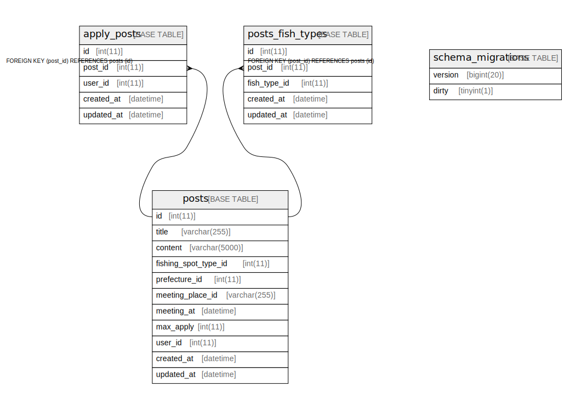

# post_DB

## Tables

| Name | Columns | Comment | Type |
| ---- | ------- | ------- | ---- |
| [apply_posts](apply_posts.md) | 5 |  | BASE TABLE |
| [posts](posts.md) | 11 |  | BASE TABLE |
| [posts_fish_types](posts_fish_types.md) | 5 |  | BASE TABLE |

## Relations

---

> Generated by [tbls](https://github.com/k1LoW/tbls)
